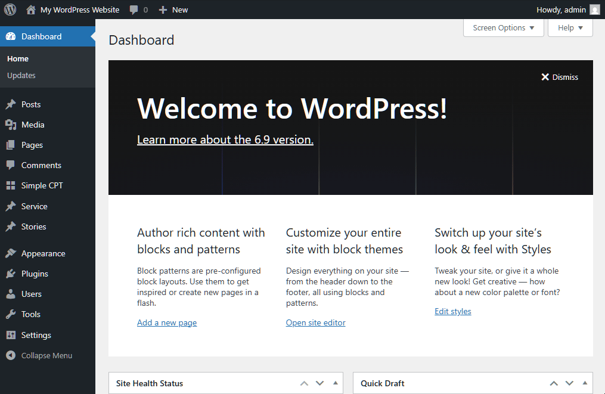

# CPT Commands

A WordPress plugin that adds a set of new search results to the site editor command palette (CMD+K/Ctrl+K) for all items filed under custom types except for those ignored from the settings page.

## Why?

WordPress has a nice time-saving feature— the command palette. It is very useful to perform quick commands and also navigate between pages or posts using keyboard alone. However, this built-in feature is limited to native Posts and Pages types. It does not return content from other content types. So, those using the site editor with Custom Types setup, this is workflow is then partially broken.

## How?

This plugin registers new sources for the WordPress command palette for each Custom Type, and pupulates the search results with links to edit the content.

Using it is very easy. Just search for "CPT Commands" in WordPress plugin directory, or download a copy from the Github repo. Install, and activate. That's it! If necessary, visit **Settings** → **CPT Commands** to exclude the types you want not to appear in the command palette.

## Need Help?

File an issue in the repo.