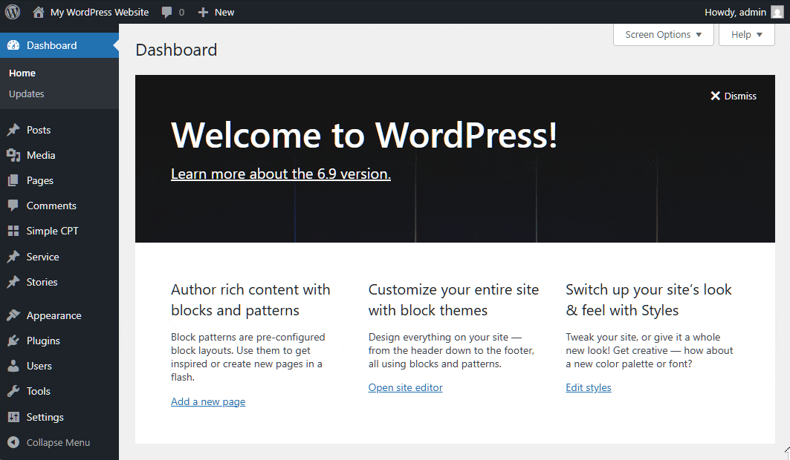

# CPT Commands

A WordPress plugin that adds a set of new search results to the site editor command palette (CMD+K/Ctrl+K) for all items filed under custom types except for those ignored from the settings page.

## Why?

WordPress has a nice feature— the command palette inside the full site editor. Quick contextual commands and navigation between pages or posts using keyboard alone saves time. However, this built-in feature is limited to native types only. It does not return content from custom content types. So, those using the site editor with content organized into custom types, this workflow breaks as soon as an attempt is made to navigate to CPT entry.

## How?

This plugin registers new sources for the WordPress command palette for each custom type, and then populates the search results with links to edit those entries.

Using it is very easy. Just search for "CPT Commands" in WordPress plugin directory, or download a copy from the Github repo. Install, and activate. That's it! If necessary, visit **Settings** → **CPT Commands** to exclude the types you want not to appear in the command palette.

## Need Help?

File an issue in the repo.